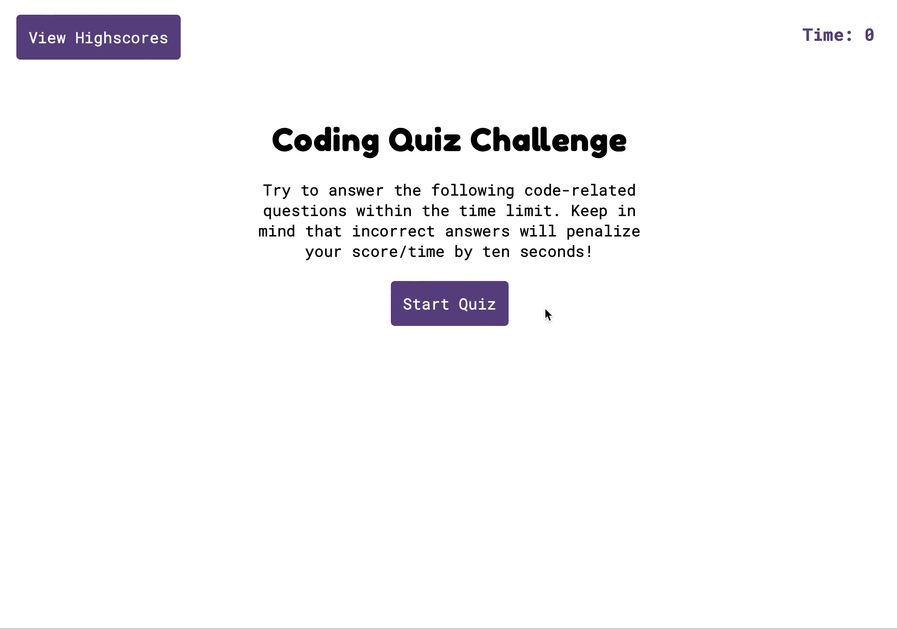

# Code Quiz

## Description

[**View Demo**](https://agia.github.io/Code-Quiz)
 
 
A timed coding quiz, using multiple-choice questions, around the topic of JavaScript basics.

The app runs in the browser, dynamically updating the HTML and CSS using JavaScript, allowing the app to keep time and score, and adapt both based on user input. It will also allow the user to save their score, and initials, at the conclusion of the quiz.

## Usage

You can use the app directly via it's Github Pages deployment (found [**here**](https://agia.github.io/Code-Quiz) or by using the `View Demo` link above).

Below is a gif showing the app in use:

## Credits

[Google Fonts](fonts.google.com), for the two main font families used (Roboto Mono and Fredoka One, in this instance).

For reference throughout, the usual suspects were helpful, as always: [MDN](https://developer.mozilla.org/en-US/), [W3Schools](https://www.w3schools.com) and [StackOverflow](https://stackoverflow.com).